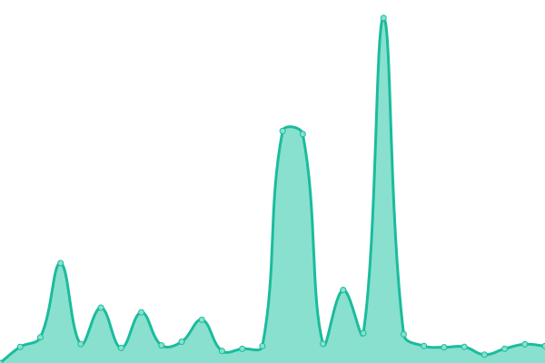
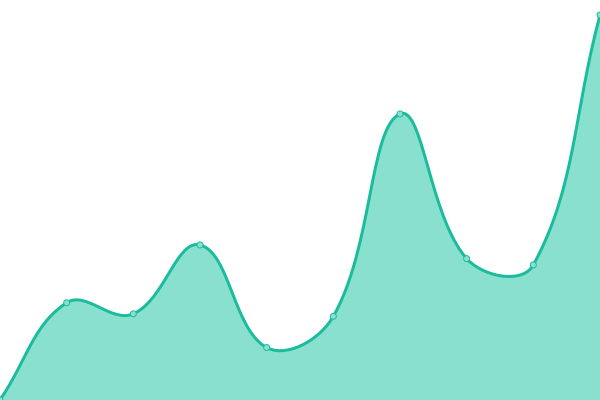
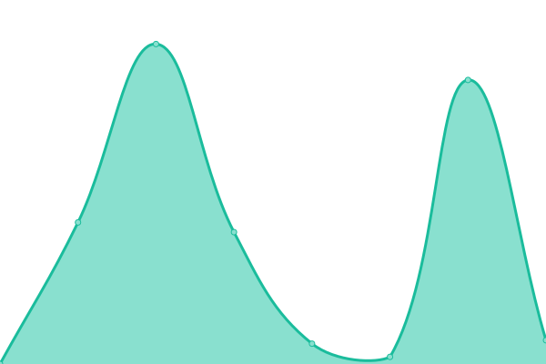
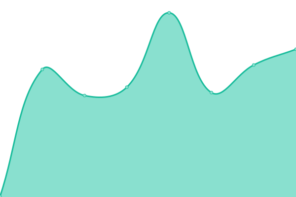
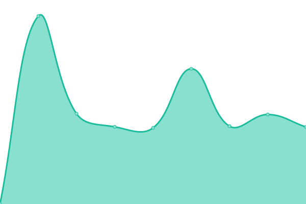
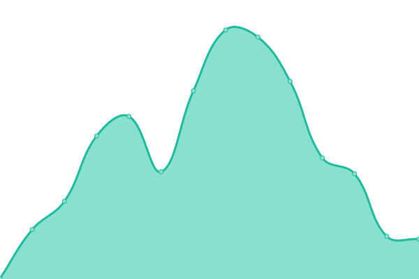

# [📈 Live Status](https://LeastAuthority.github.io/upptime): <!--live status--> **🟧 Partial outage**

This repository contains the open-source uptime monitor and status page for [Least Authority](https://leastauthority.com/), powered by [Upptime](https://github.com/upptime/upptime).

With [Upptime](https://upptime.js.org), you can get your own unlimited and free uptime monitor and status page, powered entirely by a GitHub repository. We use [Issues](https://github.com/LeastAuthority/upptime/issues) as incident reports, [Actions](https://github.com/LeastAuthority/upptime/actions) as uptime monitors, and [Pages](https://LeastAuthority.github.io/upptime) for the status page.

<!--start: status pages-->
<!-- This summary is generated by Upptime (https://github.com/upptime/upptime) -->
<!-- Do not edit this manually, your changes will be overwritten -->
<!-- prettier-ignore -->
| URL | Status | History | Response Time | Uptime |
| --- | ------ | ------- | ------------- | ------ |
|  [Web](https://www.tahoe-lafs.org/) | 🟥 Down | [web.yml](https://github.com/LeastAuthority/tahoe-upptime/commits/HEAD/history/web.yml) | 

 7108ms
     
 | 

<a href="https://LeastAuthority.github.io/tahoe-upptime/history/web">8.81%</a>
    

|  [Tickets](https://tahoe-lafs.org/trac/tahoe-lafs/query) | 🟥 Down | [tickets.yml](https://github.com/LeastAuthority/tahoe-upptime/commits/HEAD/history/tickets.yml) | 

 6134ms
     
 | 

<a href="https://LeastAuthority.github.io/tahoe-upptime/history/tickets">8.44%</a>
    

|  [Wiki](https://tahoe-lafs.org/trac/tahoe-lafs/wiki) | 🟥 Down | [wiki.yml](https://github.com/LeastAuthority/tahoe-upptime/commits/HEAD/history/wiki.yml) | 

 6145ms
     
 | 

<a href="https://LeastAuthority.github.io/tahoe-upptime/history/wiki">97.43%</a>
    

|  [GitHub](https://github.com/tahoe-lafs) | 🟩 Up | [git-hub.yml](https://github.com/LeastAuthority/tahoe-upptime/commits/HEAD/history/git-hub.yml) | 

 442ms
     
 | 

<a href="https://LeastAuthority.github.io/tahoe-upptime/history/git-hub">100.00%</a>
    

|  [GitLab](https://gitlab.com/tahoe-lafs) | 🟩 Up | [git-lab.yml](https://github.com/LeastAuthority/tahoe-upptime/commits/HEAD/history/git-lab.yml) | 

 284ms
     
 | 

<a href="https://LeastAuthority.github.io/tahoe-upptime/history/git-lab">100.00%</a>
    

|  [CodeBerg](https://codeberg.org/tahoe-lafs) | 🟩 Up | [code-berg.yml](https://github.com/LeastAuthority/tahoe-upptime/commits/HEAD/history/code-berg.yml) | 

 2227ms
     
 | 

<a href="https://LeastAuthority.github.io/tahoe-upptime/history/code-berg">99.67%</a>
    

|  [CircleCI](https://app.circleci.com/pipelines/github/tahoe-lafs/tahoe-lafs) | 🟩 Up | [circle-ci.yml](https://github.com/LeastAuthority/tahoe-upptime/commits/HEAD/history/circle-ci.yml) | 

 139ms
     
 | 

<a href="https://LeastAuthority.github.io/tahoe-upptime/history/circle-ci">99.61%</a>
    

|  [Coveralls](https://coveralls.io/github/tahoe-lafs) | 🟩 Up | [coveralls.yml](https://github.com/LeastAuthority/tahoe-upptime/commits/HEAD/history/coveralls.yml) | 

 389ms
     
 | 

<a href="https://LeastAuthority.github.io/tahoe-upptime/history/coveralls">98.33%</a>
    

|  [PyPi](https://pypi.org/project/tahoe-lafs/) | 🟩 Up | [py-pi.yml](https://github.com/LeastAuthority/tahoe-upptime/commits/HEAD/history/py-pi.yml) | 

 74ms
     
 | 

<a href="https://LeastAuthority.github.io/tahoe-upptime/history/py-pi">100.00%</a>
    

<!--end: status pages-->

[**Visit our status website →**](https://LeastAuthority.github.io/upptime)

## 📄 License

- Powered by: [Upptime](https://github.com/upptime/upptime)
- Code: [MIT](./LICENSE) © [Anand Chowdhary](https://anandchowdhary.com), supported by [Pabio](https://pabio.com)
- Data in the `./history` directory: [Open Database License](https://opendatacommons.org/licenses/odbl/1-0/)
