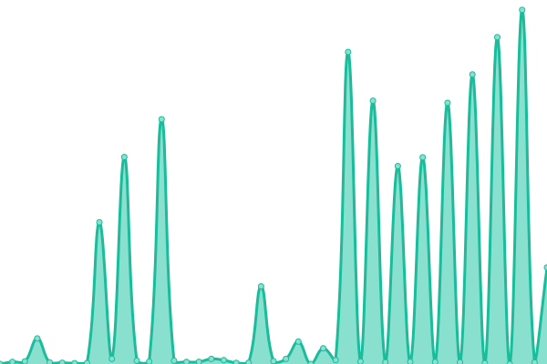

# [📈 Live Status](https://tahoe-lafs.github.io/infrastructure-upptime): <!--live status--> **🟧 Partial outage**

This repository contains the open-source uptime monitor and status page for [Tahoe-LAFS](https://tahoe-lafs.org/), powered by [Upptime](https://github.com/upptime/upptime).

With [Upptime](https://upptime.js.org), you can get your own unlimited and free uptime monitor and status page, powered entirely by a GitHub repository. We use [Issues](https://github.com/tahoe-lafs/infrastructure-upptime/issues) as incident reports, [Actions](https://github.com/tahoe-lafs/infrastructure-upptime/actions) as uptime monitors, and [Pages](https://tahoe-lafs.github.io//infrastructure-upptime) for the status page.

<!--start: status pages-->
<!-- This summary is generated by Upptime (https://github.com/upptime/upptime) -->
<!-- Do not edit this manually, your changes will be overwritten -->
<!-- prettier-ignore -->
| URL | Status | History | Response Time | Uptime |
| --- | ------ | ------- | ------------- | ------ |
|  [Web](https://www.tahoe-lafs.org/) | 🟩 Up | [web.yml](https://github.com/tahoe-lafs/infrastructure-upptime/commits/HEAD/history/web.yml) | 

 4439ms
     
 | 

<a href="https://Tahoe-LAFS.github.io/infrastructure-upptime/history/web">39.24%</a>
    

|  [Tickets](https://tahoe-lafs.org/trac/tahoe-lafs/query) | 🟩 Up | [tickets.yml](https://github.com/tahoe-lafs/infrastructure-upptime/commits/HEAD/history/tickets.yml) | 

 4352ms
     
 | 

<a href="https://Tahoe-LAFS.github.io/infrastructure-upptime/history/tickets">38.32%</a>
    

|  [Wiki](https://tahoe-lafs.org/trac/tahoe-lafs/wiki) | 🟥 Down | [wiki.yml](https://github.com/tahoe-lafs/infrastructure-upptime/commits/HEAD/history/wiki.yml) | 

 4254ms
     
 | 

<a href="https://Tahoe-LAFS.github.io/infrastructure-upptime/history/wiki">96.36%</a>
    

|  [Testgrid - alpha-introducer](testgrid.tahoe-lafs.org) | 🟩 Up | [testgrid-alpha-introducer.yml](https://github.com/tahoe-lafs/infrastructure-upptime/commits/HEAD/history/testgrid-alpha-introducer.yml) | 

 147ms
     
 | 

<a href="https://Tahoe-LAFS.github.io/infrastructure-upptime/history/testgrid-alpha-introducer">100.00%</a>
    

|  [Testgrid - beta-introducer](testgrid.tahoe-lafs.org) | 🟩 Up | [testgrid-beta-introducer.yml](https://github.com/tahoe-lafs/infrastructure-upptime/commits/HEAD/history/testgrid-beta-introducer.yml) | 

 147ms
     
 | 

<a href="https://Tahoe-LAFS.github.io/infrastructure-upptime/history/testgrid-beta-introducer">100.00%</a>
    

|  [Testgrid - alpha-storage](testgrid.tahoe-lafs.org) | 🟩 Up | [testgrid-alpha-storage.yml](https://github.com/tahoe-lafs/infrastructure-upptime/commits/HEAD/history/testgrid-alpha-storage.yml) | 

 146ms
     
 | 

<a href="https://Tahoe-LAFS.github.io/infrastructure-upptime/history/testgrid-alpha-storage">100.00%</a>
    

|  [Testgrid - beta-storage](testgrid.tahoe-lafs.org) | 🟩 Up | [testgrid-beta-storage.yml](https://github.com/tahoe-lafs/infrastructure-upptime/commits/HEAD/history/testgrid-beta-storage.yml) | 

 147ms
     
 | 

<a href="https://Tahoe-LAFS.github.io/infrastructure-upptime/history/testgrid-beta-storage">100.00%</a>
    

|  [Testgrid - gamma-storage](testgrid.tahoe-lafs.org) | 🟩 Up | [testgrid-gamma-storage.yml](https://github.com/tahoe-lafs/infrastructure-upptime/commits/HEAD/history/testgrid-gamma-storage.yml) | 

 146ms
     
 | 

<a href="https://Tahoe-LAFS.github.io/infrastructure-upptime/history/testgrid-gamma-storage">100.00%</a>
    

<!--end: status pages-->

[**Visit our status website →**](https://tahoe-lafs.github.io/infrastructure-upptime)

## 📄 License

- Powered by: [Upptime](https://github.com/upptime/upptime)
- Code: [MIT](./LICENSE) © [Anand Chowdhary](https://anandchowdhary.com), supported by [Pabio](https://pabio.com)
- Data in the `./history` directory: [Open Database License](https://opendatacommons.org/licenses/odbl/1-0/)
